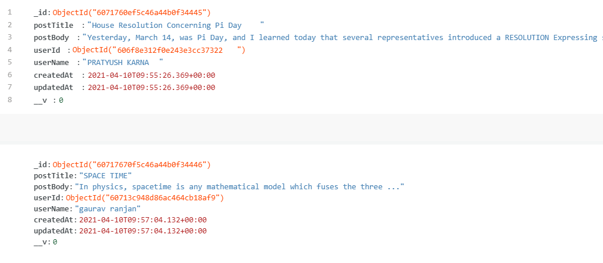
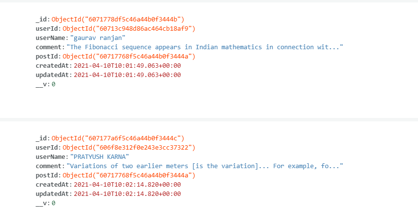

# BLOGGING WEBSITE MADE WITH NODEJS AND MONGODB. 

### On this website, people can write blogs and comments.
Used express as backend and mongodb as database. 

### Filestructure
````
├───controllers
├───db
├───models
├───node_modules
├───public
├───routes
└───views
````

1. db is used to intialize the database
2. models for defining models of each database
3. controllers to define logic of viewing, adding comments and posts
4. public for static files
5. views for dynamic hbs files
6. routes for defining each route.
   
# db for blog


# db for comments



## for live demo visit https://blog-u.herokuapp.com/